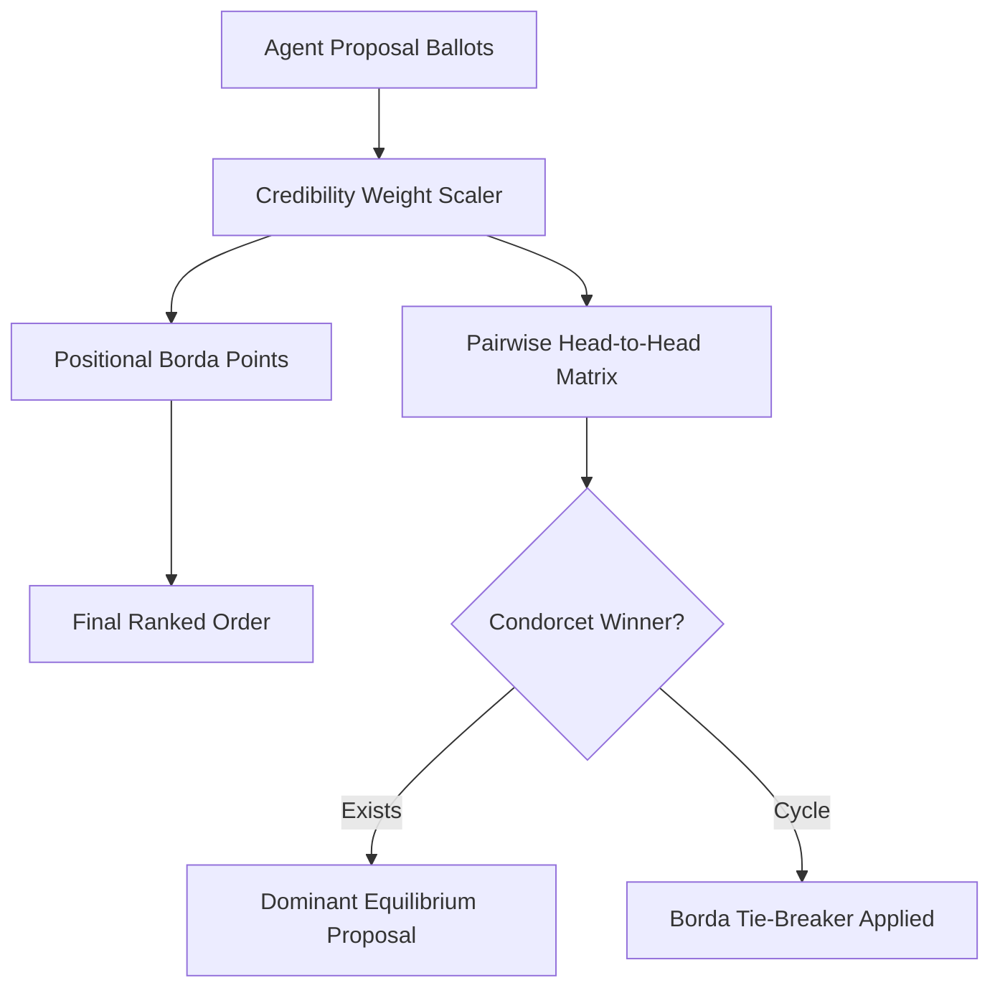

# GenPark Weighted Borda Count Preference Aggregator Skill

Weighted positional Borda voting and Condorcet preference aggregation engine for multi-agent swarms.

Check out [GenPark](https://genpark.ai) and the [GenPark MCP Catalog](https://genpark.ai/mcp).

## Features
- Weighted Borda count calculation with dynamic agent reputation multipliers.
- Pairwise tournament matrix and Condorcet winner detection.
- Pure Python standard library implementation.
